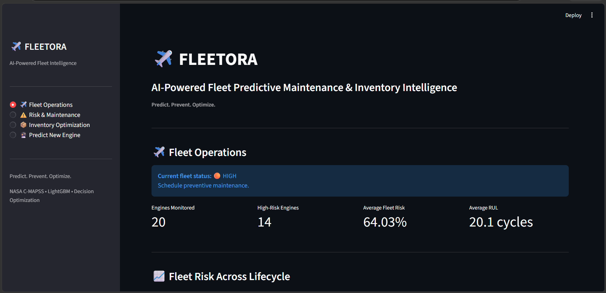
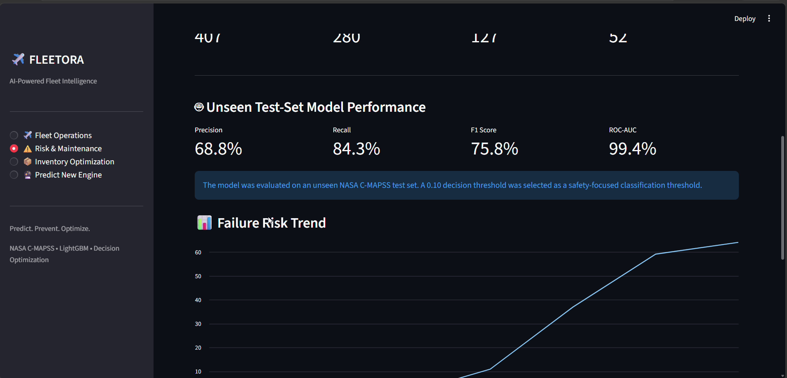
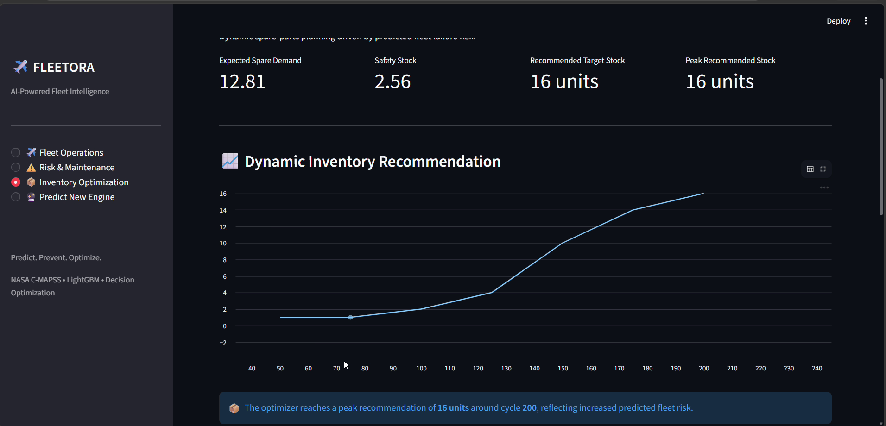
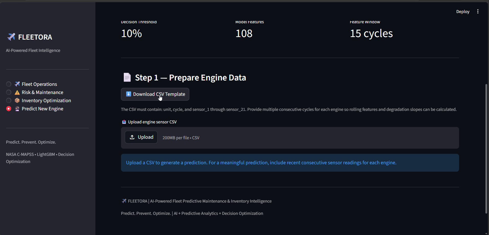

# ✈️ Fleetora

> **AI-Powered Fleet Predictive Maintenance & Inventory Optimization Platform**

Fleetora is an end-to-end AI-driven decision-support platform designed to predict aircraft engine failure risk, support proactive maintenance decisions, estimate business impact, and dynamically optimize spare-parts inventory.

---

## 🚀 Live Demo

👉 **[Open Fleetora Live Dashboard](https://fleet-predictive-maintenance.streamlit.app/)**

---

## 🎯 Problem Statement

Unplanned aircraft engine failures can lead to:

- Expensive Aircraft-on-Ground (AOG) events
- Emergency maintenance
- Flight delays and operational disruption
- High reactive maintenance costs
- Poor spare-parts planning
- Excess inventory or unexpected stockouts

Traditional maintenance approaches often react to failures after they occur or rely on fixed maintenance schedules.

Fleetora tackles this problem by combining **predictive analytics, business decision-making, and inventory optimization** into one platform.

---

## 💡 What Fleetora Does

Fleetora follows an end-to-end pipeline:

```text
Engine Sensor Data
        ↓
Time-Series Feature Engineering
        ↓
LightGBM Failure Prediction
        ↓
Failure Probability
        ↓
Decision Threshold
        ↓
Preventive Maintenance Decision
        ↓
Business Cost Analysis
        ↓
Fleet Risk Aggregation
        ↓
Probabilistic Spare Demand Estimation
        ↓
Safety Stock & Target Inventory
        ↓
Interactive Fleet Dashboard

---

## 📊 Fleetora Dashboard

Fleetora provides a multi-page interactive dashboard for monitoring fleet health, maintenance risk, business impact, inventory requirements, and new-engine predictions.

### ✈️ Fleet Operations

Provides a fleet-level overview including:

- Engines monitored
- High-risk engines
- Average fleet failure risk
- Average Remaining Useful Life (RUL)
- Fleet risk trends across the lifecycle



---

### ⚠️ Risk & Maintenance

Converts machine-learning predictions into actionable maintenance intelligence.

- Failure-risk classification
- Preventive maintenance recommendations
- Reactive vs AI-assisted maintenance cost comparison
- Cost reduction estimates
- Model performance metrics
- Decision-threshold interpretation



---

### 📦 Inventory Optimization

Converts predicted fleet risk into dynamic spare-parts planning.

- Expected spare demand
- Demand uncertainty
- Safety stock
- Target inventory
- Peak inventory requirements
- Fill rate and stockouts



---

### 🔮 Predict New Engine

Allows users to upload new engine sensor-history data and obtain an individual engine risk prediction.

The system performs the same feature engineering used during model development, generates a failure probability using the trained LightGBM classifier, applies the decision threshold, and produces a maintenance recommendation.



---